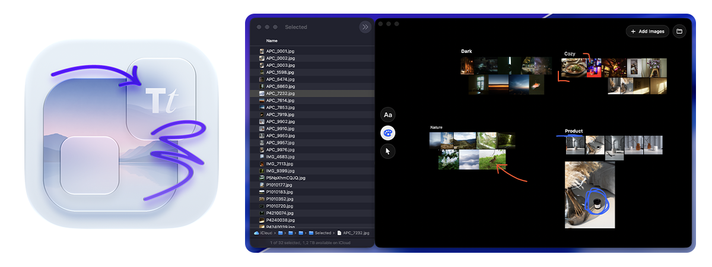

# ImageCanvas

ImageCanvas is a native macOS visual reference board for arranging locally stored images on a canvas.



## Features

- Import images from files or folders without modifying the originals.
- Three modes of arrangements: Equalized Tiled Grid and Cascading Grid (Collage and Pinterest-Style Columns), and Native grid that retains resolution of the images.
- Pan, zoom, select, move, resize, rotate, and flip board items.
- Add persistent text objects with Bold and Italic styling and session-only pen drawings.
- Board snapshots with configurable resolution. Auto-copied to clipboard and savied to Pictures (by default).
- Supported image formats: ```.jpg``` ```.jpeg``` ```.png``` ```.gif``` ```.webp``` ```.heic``` ```.heif```
- Hold Option while hovering over an image to reveal its complete filename.
- Rotate, flip, or reveal selected images in Finder from the context or Selection menu.
- Check for the latest stable release manually from the ImageCanvas menu, with automatic replacement available for writable installations.

## Requirements

- macOS 14 or later.
- To build from source: Xcode 27 beta 3 or later with the macOS SDK.

Because releases are neither notarized nor independently signed, macOS may block the first launch. Verify that the archive and SHA-256 digest came from this repository's release page, then use System Settings > Privacy & Security > Open Anyway. Building from source remains the preferred path when the code must be inspected before running it.

The built-in updater checks only the latest stable GitHub Release when requested. It verifies GitHub's published SHA-256 digest and the downloaded app's identity, version, structure, and ad-hoc signature before replacing a writable copy. GitHub supplies both the archive and its digest; this is transport and integrity validation, not independent publisher authentication. Open GitHub remains available for manual installation.

## Some Useful Shortcuts

| Shortcut | Action |
| --- | --- |
| ⌘+\ | Show or hide controls |
| P | Paint tool |
| V | Pointer tool |
| T | Text tool |
| ⌘+R | Rotate clockwise |
| ⇧+⌘+R | Rotate counterclockwise |
| ⌘+F | Flip horizontally |
| ⇧+⌘+F | Flip vertically |
| ⌘+1 | Fit the board in the window |

## Reason it exists

I was constantly facing an issue with previewing a large number of images, primarily in the Downloads folder, and spent a lot of time finding a specific image among hundreds of others. This tool allows me to select a folder containing any mix of files and preview only the images inside it in a way I used to organize them in Figma / PureRef. In addition to that it has simple organizing functions for when, say, you would want to share your screen on a Zoom call and quickly show something.  

## Development Notes

- Images are referenced from their existing locations; ImageCanvas does not copy or modify source files.
- Board layout and text objects are persisted locally in Application Support.
- Pen drawings are intentionally session-only and are never persisted.

## License

ImageCanvas is released under the [MIT License](LICENSE).
